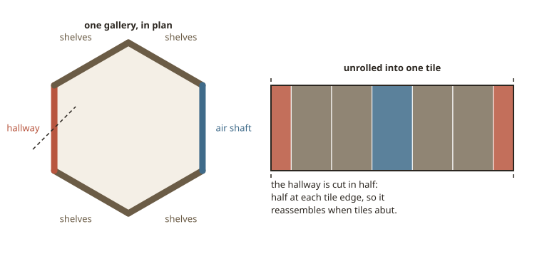

# babel-index

An AI art experiment based around the Library of Babel.

See [`concept.md`](concept.md) for what this is meant to become, and
[`docs/implementation-plan.md`](docs/implementation-plan.md) for how it gets
there.

## The demo

```sh
npm install
npm run demo
```

Then open <http://localhost:5173>. It runs against the 26-room sample in
`assets/corpus-sample/` with no further setup. The server binds every interface
and prints its LAN addresses too, so the map can be opened on a phone on the
same network — which is the only way to test the long press for real. Point it
at a bigger corpus with:

```sh
npm run demo -- --images /path/to/rooms [--base base.jpg] [--port 5173]
```

### On a platform CLIP does not build for

`@huggingface/transformers` is an **optional** dependency. It needs
`onnxruntime-node`, which publishes binaries for Windows, macOS and Linux only —
so on Android under Termux, and anywhere else it has no build for, npm skips it
and the rest of the install still succeeds. As a *required* dependency it failed
the whole install instead, which is what this arrangement is for.

Without it the demo runs and search still works: a query is ranked by keywords
and by story, just not by CLIP. The server says so at startup and the search
response says so again, so it is never a silent downgrade. To skip the heavier
tooling as well — `sharp` for the pyramid generator and Playwright for the
browser tests, neither of which the demo needs:

```sh
npm install --omit=dev --omit=optional
npm run demo
```

That leaves four runtime packages, all of which publish for Android. `npm test`
needs the dev ones; `npm run generate:embeddings` needs the optional one and
says so plainly if it is missing — generate `embeddings.bin` on a machine that
has it and copy it into the corpus directory, since the server only reads the
blob.

Offline mode is just a directory of images — no database, no bucket, no upload
step. Drag to pan, scroll or pinch to zoom, and the edge of the content region
resists. **Right-click a room** (long press on a touchscreen) to open its card:
three keywords and a short story, with each keyword a live search.

**Rooms on the map** and **non-generic %** are live controls: both re-derive the
layout without reloading any image data, so the feel of the thing can be tuned
by dragging a slider. Growing the corpus keeps existing rooms where they are and
adds further out, so the map doesn't reshuffle underneath you.

### Tuning

The values with no right answer — the zoom range, where the camera opens, where
the sliders start, how the search signals are weighted — live in
[`packages/config/config.mjs`](packages/config/config.mjs), each with the
reasoning behind it. Drop a `config.json` beside the server to override any
subset of them:

```sh
npm run demo -- --config path/to/config.json     # defaults to ./config.json
```

The overlay is partial: name only what you're changing. Anything the server
can't honour — a zoom range wider than the camera allows, a ratio outside
(0, 1] — is clamped and reported at startup rather than silently dropped.

### Search

Search ranks the **whole** corpus by a blend of three signals, so the library
rearranges around your query rather than splicing a few results to the front:

- **keywords** — three stylistic terms per room (material, movement, technique,
  artist), with an exact match outscoring a partial one;
- **story text** — a short fictional setting per room, matched by how much of
  your query it contains;
- **CLIP** — which orders everything the other two are silent about, and that is
  most of the corpus for most queries.

The first two come from a `metadata.json` beside the images, keyed on filename.
An entry may also carry an optional `alt` — one sentence describing the picture,
shown on a room's card and read by a screen reader. It is written once by the
generator, never at runtime, and a room is better off with none than with a
padded one; see [`docs/accessibility-plan.md`](docs/accessibility-plan.md) §3.5.
CLIP comes from an embedding blob: `tools/embed` runs the image tower over the
rooms once, offline; the demo server runs only the text tower per query and
returns a vector, and the browser ranks against the blob, so a re-rank costs no
round trip. Their relative weights are [config](#tuning).

Search also **clusters what it is sure about**. The best matches pack in tight
against the centre and the packing loosens outward as the confidence falls off,
so a handful of exact tags reads as a solid block while a broad, hazy match reads
as a gradient. A query nothing matches clusters nothing at all — the map stays
the even scatter it was, because a search that says "found it" about noise is
worse than one that admits it found nothing. Clearing the box restores the even
mix exactly.

The nice consequence is that the two controls stop fighting: because the cluster
is dense *relative to its surroundings*, turning the wallpaper **up** makes a
search easier to read, not harder. The `non-generic %` slider sets the density
the map falls back to, not the density of the results.

Any of the three may be missing and the rest still give a real ranking — the
panel reports which ones actually matched, rather than which were available.
Only a corpus with neither metadata nor embeddings falls back to a deterministic
pseudo-ranking, and the UI says so rather than implying the order means
anything. Sidecar keys matching no image are reported at startup rather than
passing for "no metadata".

> The `metadata.json` in `assets/corpus-sample/` is **placeholder text**, written
> so the demo's search has something to find. It describes nothing about the
> images it is attached to — which is also why it carries no `alt`: a caption
> that describes nothing about its picture is worse than none.

## What a tile is

One tile is **one shelved wall** in shallow perspective — not a whole room. 5
shelves × 32 books = 160 books per tile, four tiles to a gallery's 640.



Tiling needs no special machinery: every variant is inpainted from the same base
render with an edge-clear mask, so the frame is common to all of them by
construction.

## Tile geometry

The opening, the case uprights, all five shelf boards, **all 160 book
rectangles** and the lamp are traced off the Blender render in Inkscape and
imported:

```sh
node tools/base-image/import-shelf-svg.mjs tools/base-image/shelf_geometry.svg
```

That writes `tools/base-image/lib/measured.js`, and the importer fails loudly if
the trace stops agreeing with the story — wrong shelf count, uneven book counts,
spines outside every bay. If the tile's aspect changes, the trace changes with
it: the SVG's `viewBox` and `BASE_TILE` are two statements of one fact, and the
tests fail if they drift apart.

## The resolution pyramid

Zoomed out the map draws thousands of cells, so it does not draw them at full
resolution. Smaller levels are generated once, offline:

```sh
npm run generate:mips -- --images <dir>          # in place
npm run generate:mips -- --images <dir> --out <dir>
```

That writes `<dir>/<width>/<file>` for every level below the source, leaving the
originals where they are as level 0 — so running it on a corpus adds the smaller
levels and changes nothing that was already there. The ladder, the cache budgets
and the level-picking policy all live in
[`packages/web/src/pyramid.js`](packages/web/src/pyramid.js), which is the file
to edit to tune any of it.

The map uses them: the server reports which levels a corpus actually has, the
cache keys on `(room, level)` with a budget per level, and each frame picks the
smallest tile that is not smaller than the cell it covers. Zoomed right out that
is a 64×48 thumbnail, so a screen of thousands of rooms costs tens of megabytes
instead of tens of gigabytes. A cell never draws nothing: whatever level of that
room is resident stands in until the right one arrives, and the generic room is
pinned as the floor beneath that. **A flat directory still works** — a corpus
with no `<width>/` directories simply has one level, and everything resolves to
it.

`assets/corpus-sample/` ships with all five levels generated, so the demo shows
this without setup.

The tile is 1024×768 today, and neither the size nor the shape is fixed.
`BASE_TILE` is the only place either is stated; everything else derives from it,
and the tests will tell you what a new shape breaks. The library stays **round
on screen** at any cell shape rather than round in the index, so the edge is the
same distance away whichever way you drag.

| | |
| --- | --- |
| `packages/server/` | offline demo server: scans a directory, serves a manifest |
| `packages/web/` | canvas map — pan, zoom, live layout controls |
| `packages/map/ordering.js` | slot placement, ranking, pan resistance |
| `packages/pipeline/` | the resolution-pyramid generator |
| `tools/base-image/` | tile geometry and the SVG importer |
| `assets/blender/` | the base render source |
| `docs/borges-parameters.md` | every number, with the passage it comes from |

```sh
npm test    # ~300 tests, no browser and no network
```

`node --test` discovers `*.test.mjs`, so a new test file needs no wiring.
Covered: the map layout, the measured geometry, the directory scan and its
level discovery, the server API, the camera maths, the tile cache, the render
loop (including what a zoomed-out frame costs in bytes), the resolution-pyramid
policy and the pyramid generator. Image fixtures are
synthesised per test, so nothing depends on `assets/corpus-sample/` staying
exactly what it is. The camera, the pyramid and the map layout are each
exercised at several tile shapes, so none of them assumes a square.

Every push and every pull request to `main` runs the suite on Node 20, 22 and 24
([`.github/workflows/ci.yml`](.github/workflows/ci.yml)); `ci` is the single
check to require for merging.

The canvas is covered separately, by a browser smoke test that drives the real
demo server — load, pan, zoom, both sliders, a search, no console errors, and
that the canvas is actually painted rather than merely present:

```sh
npx playwright install chromium   # once
npm run test:e2e
```

It is not in `npm test` and not in the pull-request job: a browser is more
machinery than every push deserves. Run it when the map itself changed, or from
the Actions tab — [`e2e.yml`](.github/workflows/e2e.yml) is manual-dispatch only
and uploads the last frame as an artifact. See
[the testing section](docs/implementation-plan.md#3a-testing) for what each
layer is for.
