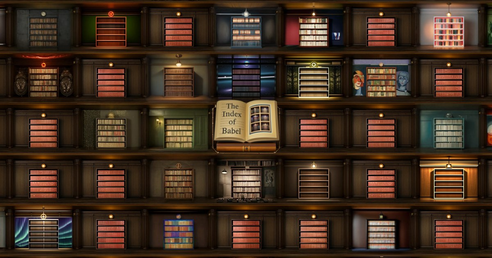
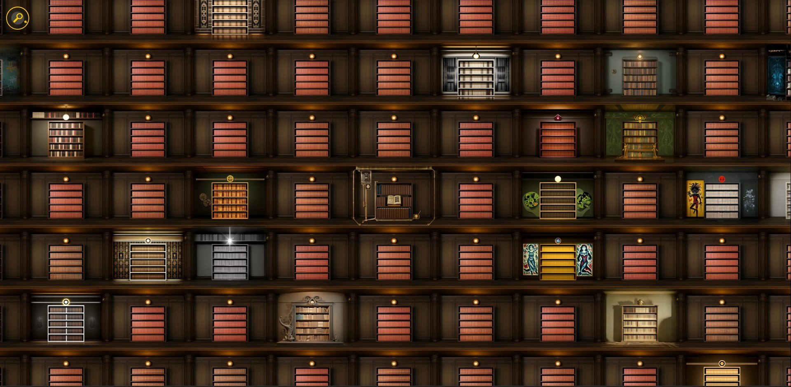
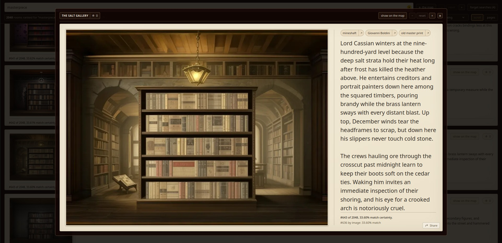
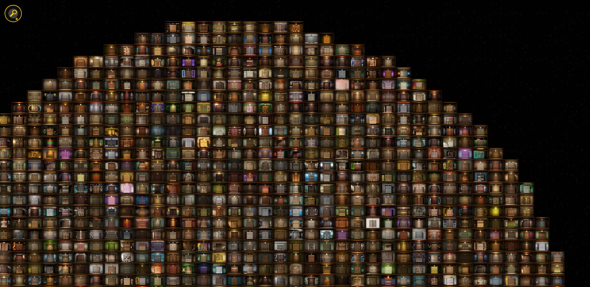
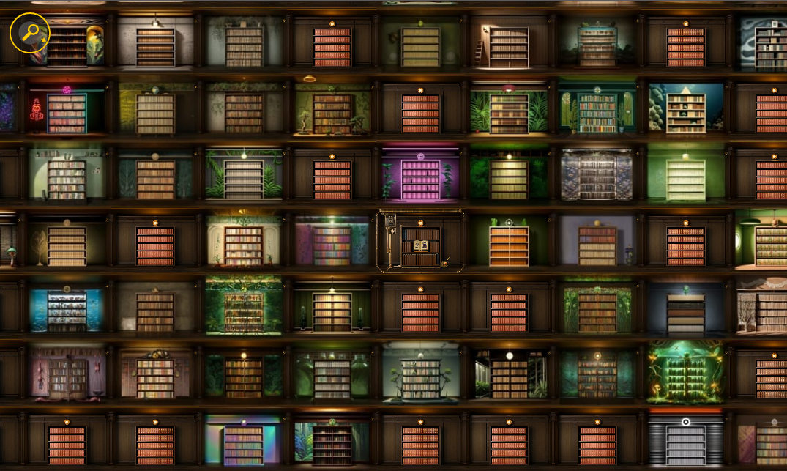
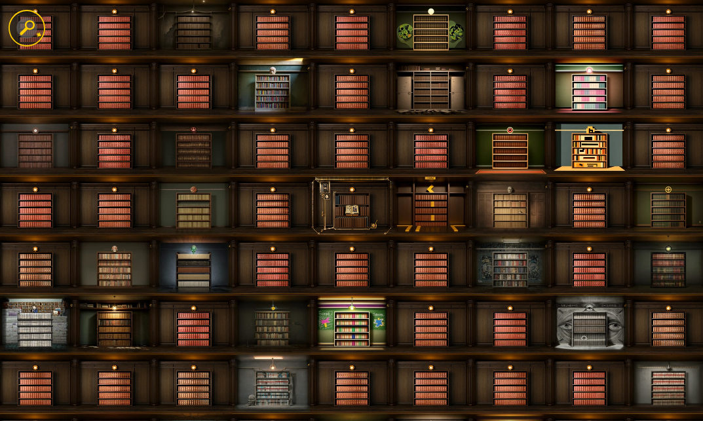

# The Index of Babel

[](https://github.com/centuryglass/babel-index/actions/workflows/ci.yml)
[](https://github.com/centuryglass/babel-index/actions/workflows/codeql.yml)
[](https://github.com/centuryglass/babel-index/actions/workflows/deploy.yml)

<!-- Stands in for the social-card unfurl you'd get linking the site directly:
     the same og-image.jpg, title and description index.html's og:*/twitter:*
     meta tags carry. GitHub markdown has no card shorthand, so it is a
     one-column table for the border, with the image width in pixels rather
     than a percentage - a GitHub table sizes to its content, so a percentage
     here has nothing to resolve against. -->

<table>
<tr><td>
<a href="https://centuryglass.us/babel-index/"></a>
</td></tr>
<tr><td>
<sub>CENTURYGLASS.US</sub><br>
<b><a href="https://centuryglass.us/babel-index/">The Index of Babel</a></b><br>
A pannable, zoomable map of AI-generated library rooms, loosely based on the
Library of Babel.
</td></tr>
</table>

This repository has two audiences.

It is **an art piece**: a love letter to the work of exploring and curating the
infinite variation found in generative imagery. The search is depicted as a
vast library, where you can explore thousands of hand-picked variant shelves,
each with its own story. To help in the hunt, you can rearrange the shelves,
searching based on image content, tags used for image generation, and story
text. You can tag your favorites, and view the ones that other people liked
the most.

It is also **a working, deployed web application**, built and maintained as a
real software project. It has required CI across Node 20/22/24, automated
deployment with release validation, unit tests for the core logic, and
Playwright tests for the deployed application. If that's what you're here for,
skip to [**How it's built**](#how-its-built) or read
[`docs/architecture.md`](docs/architecture.md) for the five-minute version.

This project was coded with significant AI assistance, primarily through
Claude Code and OpenCode. It's become clear over the last few months that
agentic software development is here to stay, and keeping up with the
industry requires adapting to that kind of workflow. This project also serves
as a personal testing-ground for ways to improve agentic workflows and
ensure AI agents reduce technical debt instead of magnifying it.

Content warning: horror, body-horror, death, insects/arthropods, gore, and
trypophobia. Most examples are fairly mild and only present in occasional
rooms. Any of these tags can be blocked using URL parameters, e.g.
https://centuryglass.us/babel-index/?blockTags=horror,death or through the
content settings controls at the bottom of the help dialog opened through
the "READ ME" book.

## The Library

[The Library of Babel](https://en.wikipedia.org/wiki/The_Library_of_Babel)
is a short story by Jorge Luis Borges, published in 1941. This project uses
the library as a metaphor for the exploration of randomness, imagining the
creation of an index that pulls in books from other, more meaningful
hypothetical libraries.

The main interface is a gigantic map of that library. Most shelves are still
the same meaningless shelves from the Borges story, but scattered among them
are 2048 unique shelves, each an AI-generated art piece with its own story.
I've exhaustively curated and refined both the images and stories, ensuring
all of them are at least somewhat interesting.

|  |
| --------------------------------------------------------------------------------------------------------------------------------- |
| Pan around the map to explore the library and discover unique shelves.                                                            |

|  |
| ---------------------------------------------------------------------------------------------------------------------- |
| Right-click/tap and hold on any room to see its name, its story, and how closely it matches an active search.          |

|  |
| ------------------------------------------------------------------------------------------------------------------------------ |
| Activate "distill mode" in the center of the library to banish the identical shelves, pulling in only unique ones.             |


## Search, and the density gradient

|  |  |
| -------------------------------------------------------------------------------------------------- | ------------------------------------------------------------------------------------------------------------- |
| A search for "plants" finds many close matches and pulls them close to the center.                 | A search for "sociology" finds few close matches, so only a few unique rooms are drawn towards the center.    |

A search does not just re-rank the library; it changes the library's shape.
Rooms the search is confident about are pulled toward the center, and the
generic filler shelves around them are thinned out in proportion to that
confidence. A query the library can answer clusters tightly. A query it
cannot stays diffuse. The map tells you how much to trust the result before
you have read a single room.

Ranking and certainty are separate measurements. Ranking combines CLIP image
embeddings, keyword matches, and story text, then normalizes and min-maxes
those scores across the corpus for the query. This means some room always
scores 1.00, regardless of what was searched for.

Certainty instead uses raw cosine distances against absolute bounds calibrated
from a real corpus. Nonsense queries therefore produce scores near zero
rather than creating an artificial "best match", and the density gradient
stays flat when the search has little to say.

[`docs/search_rules.md`](docs/search_rules.md) is the full specification;
[`packages/map/scoring.ts`](packages/map/scoring.ts) and
[`packages/map/ordering.ts`](packages/map/ordering.ts) are the implementation.

## The Catalog

Not everyone wants to fly around a map. The catalog is a second reading of
the same corpus: a conventional search box and a paged, ranked list of every
unique room.


It is not an accessibility mode - the map itself is keyboard-navigable and
screen-reader annotated. A linear list was rejected as an accommodation and
kept as a control for everyone.

## Rooms and stories

Every unique room has a title, three style tags, a short story, and a place
on the map. Right-click a room (or long-press on mobile) to read it, along
with a breakdown of why the active search ranked it where it did.

Rooms were generated with Stable Diffusion, using ControlNet to anchor every
one of them to the structure of a base room modeled and rendered in Blender
([reference render](reference/blender/base_render.png)). Most rooms were also
edited in [IntraPaint](https://github.com/centuryglass/IntraPaint) to fix
errors and enhance details. Stories were written by various LLMs from the
image and its tags, then curated and edited by hand. The images, keywords,
and stories are all public domain.

The open book at the center of the index shelf holds the project's story
and my artist's statement:


> The full walkthrough of every control - the index shelf's twelve, the room
> overlay's eight - is in [`docs/user-guide.md`](docs/user-guide.md), or in
> the app's "READ ME" book.

## How it's built

One Node/Express process serves the API and the client. There is no database,
no separate framework server, and no build step. The application has seven
runtime dependencies.

[`docs/architecture.md`](docs/architecture.md) is the five-minute overview;
these are the parts worth a look.

The application runs directly from TypeScript source. `packages/server/index.ts`
starts an esbuild context at startup and serves the client bundle from memory,
while [`build/`](build)'s Node ESM loader transforms `.ts` and `.tsx` modules
as they are imported. There is no `dist/` directory or separate compilation
step to keep in sync.

The map is virtualized and has both WebGL2 and Canvas2D renderers, with WebGL2
used where supported. The two renderers have independent draw loops, and
`npm run test:parity` can compare their output on a real GPU when either one
changes.

The map's rearrangement is implemented as a local sliding-tile illusion
rather than physically relocating the entire corpus. Only the visible region
needs to be rearranged, and tiles that will become visible are prefetched
before the animation begins.

The server also validates deployments against the code that is actually
running. `/api/health` reports the loaded git commit, and the deployment
health check verifies that it matches the commit being released both locally
and through the public URL. A deployment that starts successfully but serves
zero rooms is rejected.


Favorites are stored as sets rather than counters. Each browser generates a
random identifier, and the server stores a salted hash of that identifier for
each room. Favoriting the same room twice therefore has no additional effect,
and removing a favorite that isn't present does nothing.

The server cannot reconstruct a visitor's personal favorites from these
hashes, and personal favorites are kept in the browser. Rate limiting uses
the request address separately from the favorite identifier.

The test suite covers the pure logic in `packages/map`, `packages/config`,
`packages/pipeline`, and most of the server without starting a browser or
using the network. Playwright provides browser-level tests, and lint,
typechecking, CodeQL, and the file-map check are required CI checks.

## Project structure

|                           |                                                                                                                                    |
| ------------------------- | ---------------------------------------------------------------------------------------------------------------------------------- |
| `build/`                  | the Node-side TypeScript hook (`--import ./build/register.mjs`) that lets every script run `.ts` sources directly, no compile step |
| `packages/server/`        | offline demo server: scans a directory, serves a manifest                                                                          |
| `packages/web/`           | React + canvas map - pan, zoom, search, live layout controls                                                                       |
| `packages/map/`           | placement, ranking, scoring, the rearrangement animation - no DOM                                                                  |
| `packages/config/`        | the by-feel numbers, with the reasoning behind each                                                                                |
| `packages/pipeline/`      | the resolution-pyramid generator                                                                                                   |
| `deploy/`                 | the VPS deploy script, its SSH forced command, and the health check both halves of the pipeline share                              |
| `infra/`                  | Terraform for the Cloudflare R2 bucket the corpus lives in                                                                         |
| `tools/center-placement/` | tile geometry and the SVG importer                                                                                                 |
| `tools/embed/`            | computes and stores CLIP image embeddings for a corpus                                                                             |
| `tools/upload/`           | syncs a corpus to Cloudflare R2, incrementally by content hash                                                                     |
| `tools/font-lab/`         | ad hoc design lab for the center shelf's spine titles (not wired into any npm script)                                              |
| `tools/curation/`         | Python/Qt tools for turning generated tiles into `metadata.json` - a separate ecosystem, with its own `README.md`                  |
| `assets/corpus-sample/`   | a ready-to-run sample corpus                                                                                                       |

> See [`docs/architecture.md`](docs/architecture.md) for a five-minute
> system overview, or [`docs/file_map.md`](docs/file_map.md) for the full
> file-by-file layout.

## Running it locally

Requires Node 20 or newer (CI runs 20/22/24).

```sh
npm install
npm run demo        # http://localhost:5173, against assets/corpus-sample/
```

CLIP-based search (`@huggingface/transformers`, via `onnxruntime-node`) is
optional: it only supports win32/darwin/linux, so nothing else in the demo
requires it, and it is never imported statically. Without it, search still
works from keyword and story matching alone, just without the embedding
signal.

The base demo uses a tiny set of sample images included with this repo. To run
it against a larger set of image tiles:

```sh
npm run demo -- --images /path/to/rooms [--port 5173]
```

To record global favorite counts, point it at a file to keep them in:

```sh
npm run demo -- --favorites path/to/favorites.json [--trust-proxy 1]
```

Without `--favorites`, no counts are recorded and no favorite control
appears. When favorites are enabled, the stored data is a set of salted hashes
of random IDs generated by browsers: enough to prevent one visitor from
favoriting the same room twice, but not enough to reconstruct anyone's
personal favorite list. Personal favorites remain in the browser.

`--trust-proxy` is needed behind a reverse proxy because Express otherwise
sees the proxy's address rather than the visitor's when rate limiting.
The proxy must send `X-Forwarded-For` for this to work.

### Running it with Docker

```sh
docker build -t babel-index .
docker run -p 5173:5173 babel-index
```

Against your own image tiles instead of the sample corpus, mount them and pass
`--images` the same way you would to `npm run demo`:

```sh
docker run -p 5173:5173 -v /path/to/rooms:/data:ro babel-index --images /data
```

Any flag from above works the same way, appended after the image name. Pass
`--build-arg WITH_CLIP=false` for a smaller image that skips the CLIP text
tower and ranks by keywords and story only.

### Configuration

Values that can be adjusted to taste (zoom range, opening camera, slider
defaults, search weights, etc.) are in
[`packages/config/config.ts`](packages/config/config.ts), each with its
reasoning. Override any subset with a `config.json`:

```sh
npm run demo -- --config path/to/config.json     # defaults to ./config.json
```

### Testing

```sh
npm test              # node --test, no browser and no network
npm run test:e2e      # browser smoke test (npx playwright install chromium once)
npm run lint
npm run typecheck
npm run check:file-map  # Ensures docs/file_map.md covers all major project files
```

CI runs the unit tests on Node 20/22/24 and the e2e suite; the aggregate
`ci` check needs both, and it gates merges. `npm run test:parity` is a
separate, manual Canvas2D-vs-WebGL render comparison that needs a real GPU
and is not part of CI.

## Documentation

* [`docs/architecture.md`](docs/architecture.md) - a five-minute system overview: request flow, deploy, rendering, testing
* [`docs/user-guide.md`](docs/user-guide.md) - every control in the library, annotated
* [`docs/api.md`](docs/api.md) - the `/api/*` request/response contract
* [`docs/file_map.md`](docs/file_map.md) - the full file-by-file layout
* [`docs/concept.md`](docs/concept.md) - the initial project concept and a dated log of select design decisions
* [`docs/keyboard-controls.md`](docs/keyboard-controls.md) - the full keyboard spec for the map view
* [`docs/search_rules.md`](docs/search_rules.md) - the full specification of what a search does
* [`deploy/README.md`](deploy/README.md) - the one-time VPS setup and the rollback path
* [`AGENTS.md`](AGENTS.md) - notes for coding agents (engineering conventions and invariants)
- [GitHub issues](https://github.com/centuryglass/babel-index/issues) — all open tasks.

## License

This repository - the code, tile geometry, sample corpus, and every document
in it - is released under [the Unlicense](LICENSE): a public-domain
dedication with no conditions attached.

The full corpus of generated rooms hosted live at
[centuryglass.us/babel-index](https://centuryglass.us/babel-index/) (images,
keywords, and story text - synced to R2 by `tools/upload`, not checked into
this repo) is dedicated to the public domain under
[CC0](https://creativecommons.org/publicdomain/zero/1.0/).

Both dedications are offered as a matter of clarity rather than an
acknowledgment that copyright otherwise applies: most of this material is
AI-generated, and under current US Copyright Office guidance, purely
AI-generated output with no human authorship is not eligible for copyright
protection in the first place. Where a human edit (retouching an image,
writing or revising a story) might arguably introduce enough authorship to
matter, the Unlicense/CC0 dedication is what removes any doubt.
