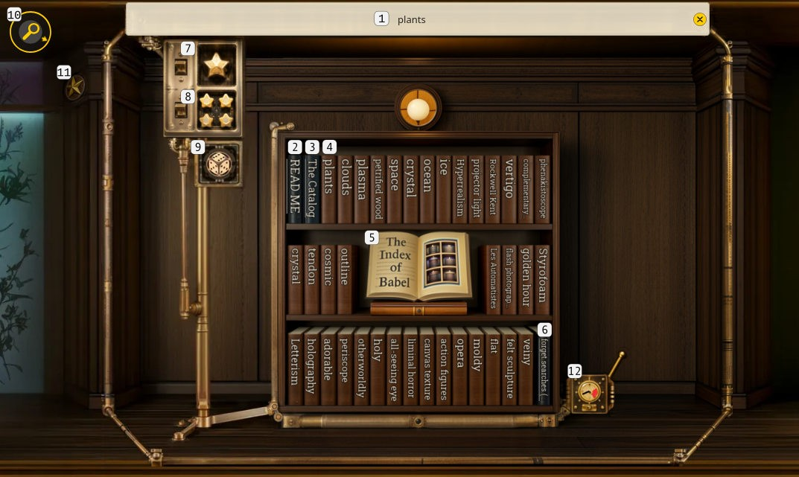
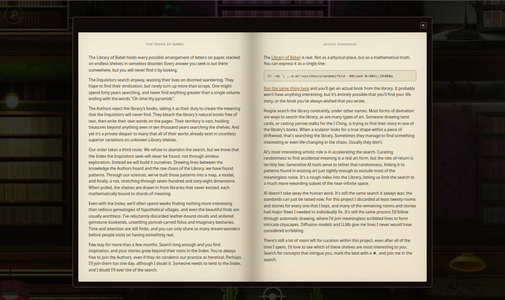
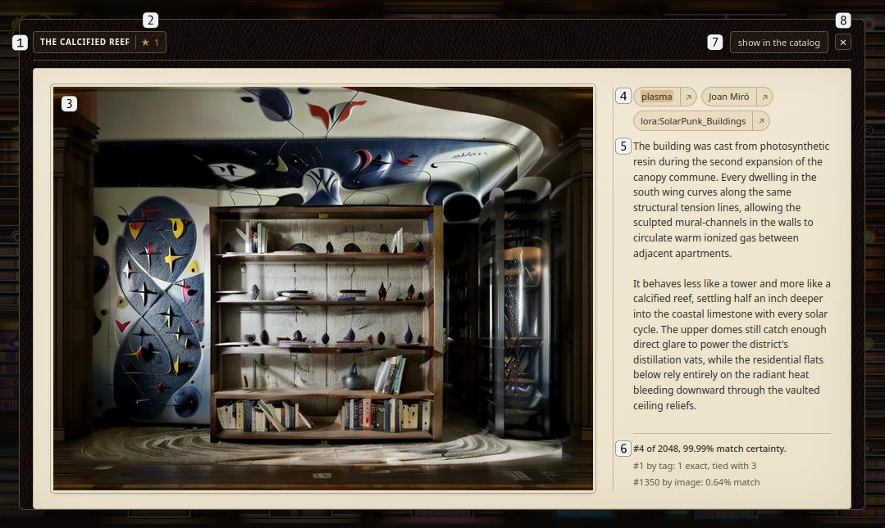

# User guide

What every control in the library does, annotated. This is the same ground
the in-app help window covers - the "READ ME" book on the center shelf - kept
here as a browsable set of figures for anyone reading the repo rather than
visiting the site. [`README.md`](../README.md) is what the project is and how
to run it.

## The Index Shelf

The center shelf lets you search the library and rearrange its shelves.

1. Enter anything into the search bar and the library will rearrange, moving
   rooms so that the closest matches are nearest to the center. Searches will
   match rooms by titles, style tags, story text, and image content. See
   [`search_rules.md`](search_rules.md) for the full specification of what a
   search does.
2. The "READ ME" book opens the help window. The help window describes the
   controls and provides access to content settings controls you can use
   to block rooms that might bother some people.
3. "The Catalog" opens an alternate list interface for viewing library
   shelves, for anyone who'd rather explore this project as a data set
   instead of a fictional space.
4. The remaining books on the shelves hold your search history. If your
   search history doesn't fill the shelf, the remaining books hold a random
   set of tags present within the library. Click any book to repeat the
   search.
5. Clicking the open book in the center will open the project's story and
   my artist's statement:

   
6. The bottom-right book will clear your search history.
7. This switch rearranges the library to bring rooms you've marked as
   favorites closest to the center.
8. This switch sorts the library by global favorite counts, bringing the rooms
   that the most people have favorited closest to the center.
9. The shuffle button clears active searches and rearranges the library in a
   new random order.
10. The search button is visible anywhere on the map, and the arrow orbiting
    it always points to the index room. Click it to zoom back to the search
    bar from anywhere on the map.
11. This star is the favorite toggle for the next room to the left. Clicking
    it marks that room as one of your favorites, making it easier for you to
    find again, and adding to the global favorite count. Global favorite data
    is tied to individual browser sessions and is fully anonymized.
12. The distill mode switch banishes all of the near-identical Library of
    Babel shelves from the map, leaving only the unique rooms pulled in by
    the index.

## A room's details

Right clicking a room or long-clicking on mobile will open up a library room's
story and details.

1. Each unique room has its own title.
2. The star icon lets you see how many people have favorited this room, and
   lets you add or remove it from your own list of favorite rooms.
3. The room image, as you'd see it on the map. Rooms were generated using
   Stable Diffusion, using ControlNet to anchor them to the same structure as
   an initial room I modeled and rendered in Blender
   ([reference render](../reference/blender/base_render.png)). Feel free to
   right-click and save rooms and do whatever you'd like with them, they're
   all public domain images.
4. Each room was generated using three style tags. Style tags include artists,
   art styles, materials, LoRA models, and all kinds of other things used to
   affect the style of the generated rooms. Click any tag to search the
   library for other rooms matching that tag. Click the arrow on the right
   side of the tag to open an external site where you can learn more about it.
5. Each library room contains a very short story telling you something about
   the fictional world that particular shelf came from. Stories were written
   by various LLMs based on the image and tags.
6. When a search is active, this block will tell you how closely this room
   matches the search term, breaking down exactly what elements are matched.
7. Click this button to find this room within the catalog mode. If you're
   already in catalog mode, it's replaced by a "show on the map" button.
8. Clicking here, clicking outside of the frame, or pressing escape closes the
   overlay.

## The catalog

The catalog contains every unique room in the library as a dataset you can
browse, for anyone who'd rather read the library as a list than fly around it.

It is not the accessibility mode - the map itself is keyboard-navigable and
screen-reader annotated. The catalog is a second reading of the same corpus,
offered to everyone.

## Keyboard controls

Every key the map view handles, state by state, is specified in
[`keyboard-controls.md`](keyboard-controls.md). The short version: Tab moves
between controls, the arrow keys pan the map (or move between books once the
center shelf has focus), Enter opens the focused room, and Escape closes
whatever is open.
